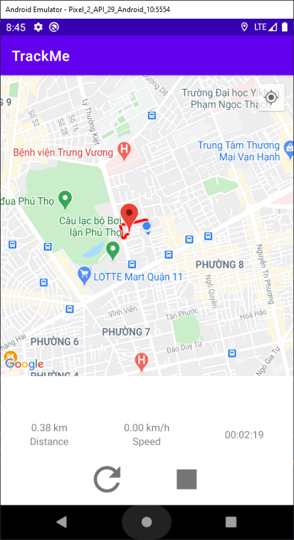

TrackMe
=======

An application which helps user tracking speed, distance and duration during workout sessions.

Getting Started
---------------

TrackMe uses the Maps SDK for Android to load maps throughout the app. To use the API, you will need to obtain a API key. See the
[Maps SDK for Android Documentation](https://developers.google.com/maps/documentation/android-sdk/get-api-key) for instructions.

The app can not work properly without an API key.

UI Mockup
---------

Requirements
------------

### General

* The application is required to support Android 5.0+
* User should be noticed by the application to grant all permissions: Location Permission, Location Service, etc.
* Data structure, Database storage are decided by Developer

### History

* List out all workout sessions. User may have unlimited sessions in history, latest session is on the top of list
* Application is required to work smoothly while user scrolls down to view sessions in past
* Each session: Display Map Route, Distance, Duration and Average Speed
* User taps on Record button to start a new session

### Record

Record Current Speed, Current Distance and Duration
* Display Current Speed, Current Distance and Duration
* Start Location should be displayed on the Map
* Current Location of user should be displayed on the Map
* Route should be displayed on the Map
* User should be able to Pause, Resume, Stop current session
* To save battery, the application is required to be able run in background or when phone screen is off
* When the application is in background and there is active session is being recorded, if user opens the app again, it should navigate user to active session (Record screen):
  * Current Distance, Current Speed and Duration are required to be updated correctly when user opens the app from background
  * Route Map is required to be updated correctly when user opens the app from background
  * Pause, Resume and Stop button should keep its state when user opens the app from background

### Note

* Current Speed: Realtime speed of user, calculated by GPS or (v = s / t)
* Average Speed: Average of all speed information recorded during workout session

### Deadline
7 days

Screenshots
-----------

Featured
--------

- MVVM Architecture
- Repository Pattern
- Maps SDK for Android
- Maps SDK for Android Utility Library
- Android KTX
- Data Binding
- Lifecycles
- LiveData
- Navigation
- Room
- ViewModel
- Hilt
- Kotlin Coroutines
- ktlint

Author
-------

### Nguyễn Vĩnh Khang
nvkhang96@gmail.com

License
-------

Copyright 2020 Nguyễn Vĩnh Khang

Licensed to the Apache Software Foundation (ASF) under one or more contributor license agreements. See the NOTICE file distributed with this work for additional information regarding copyright ownership. The ASF licenses this file to you under the Apache License, Version 2.0 (the "License"); you may not use this file except in compliance with the License. You may obtain a copy of the License at

http://www.apache.org/licenses/LICENSE-2.0

Unless required by applicable law or agreed to in writing, software distributed under the License is distributed on an "AS IS" BASIS, WITHOUT WARRANTIES OR CONDITIONS OF ANY KIND, either express or implied. See the License for the specific language governing permissions and limitations under the License.